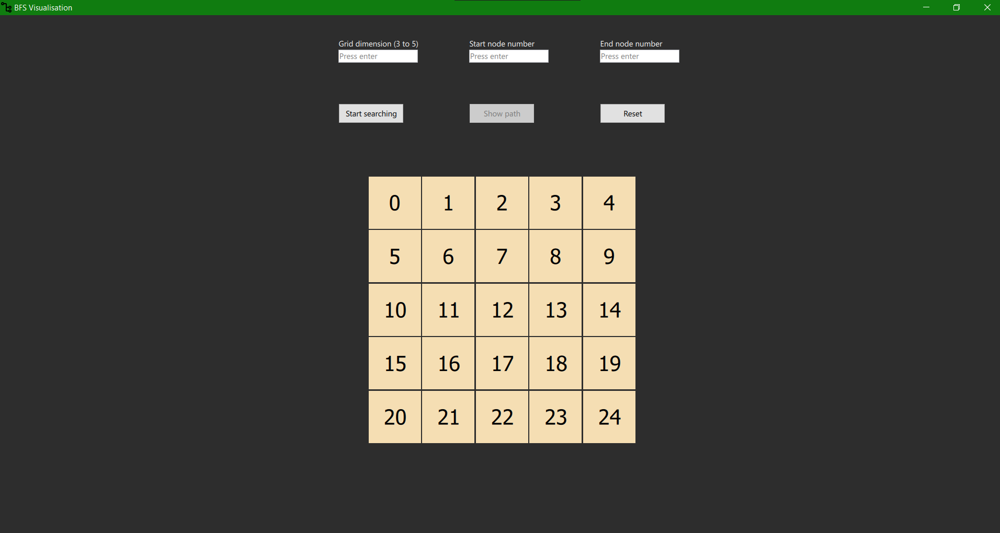

# BFS-algorithm-visualization
##Description:

BFS Algorithm Visualization is a C++-qt-based application designed to illustrate the Breadth-First Search (BFS) algorithm in action. BFS is a fundamental graph traversal algorithm used in various applications such as shortest path finding, network analysis, and more.

This application provides an intuitive visual representation of how BFS operates on a grid. The algorithm's progress is displayed step-by-step, allowing users to observe how BFS visits nodes layer by layer, expanding outward from the source vertex.

##Key Features:

*Step-by-Step Visualization: The application animates the BFS algorithm step by step, showing the exploration of nodes in each layer.
*Node Highlighting: Nodes visited during the BFS traversal are highlighted, providing clarity on the algorithm's progress.
*Customization Options: Users can adjust parameters such as grid dimenstion, start vertex, end vertex.
*Educational Resource: Ideal for students, educators, and anyone interested in understanding graph algorithms, the application serves as a valuable educational tool.

Whether you're learning about BFS for the first time or looking to deepen your understanding of graph traversal algorithms, BFS Algorithm Visualization offers an engaging and informative experience. Dive into the world of graphs and explore the workings of BFS with this user-friendly application.

##Screenshot:

